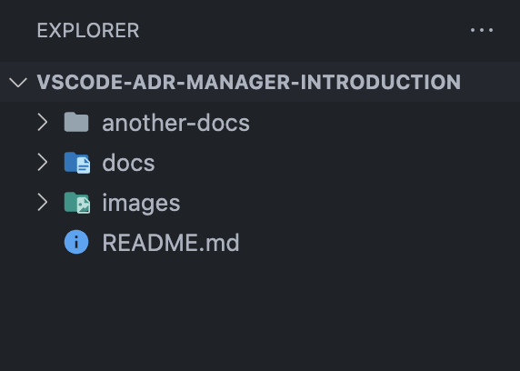
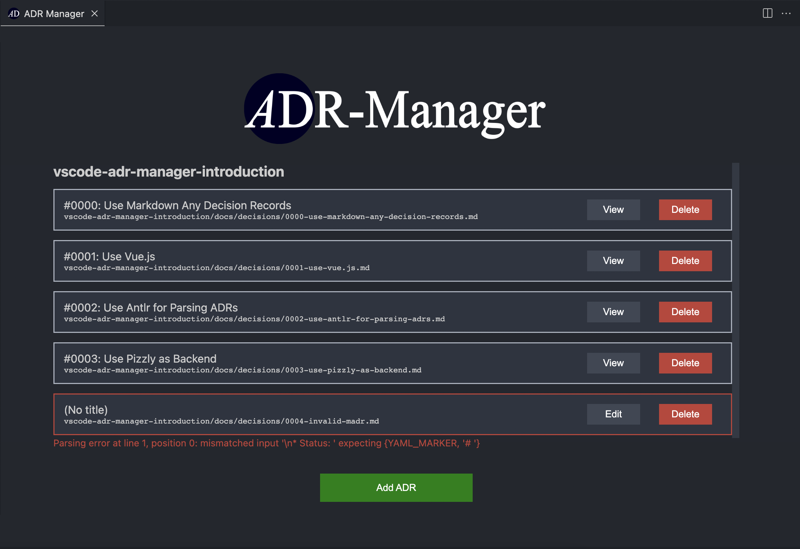
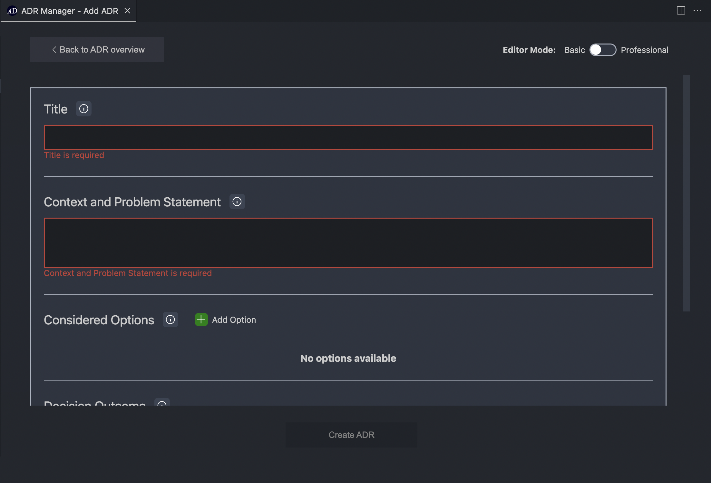
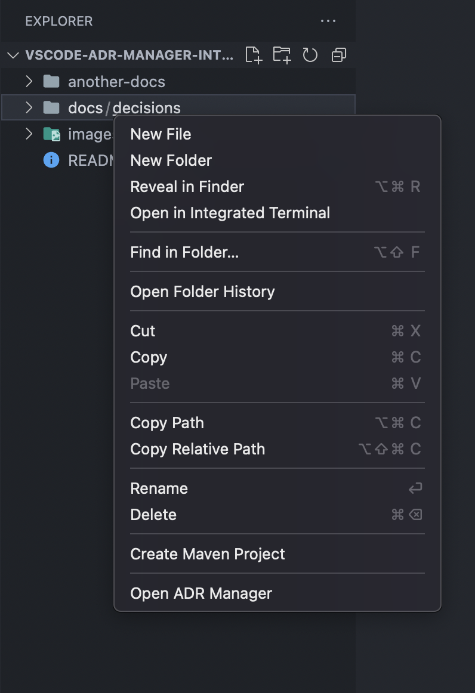
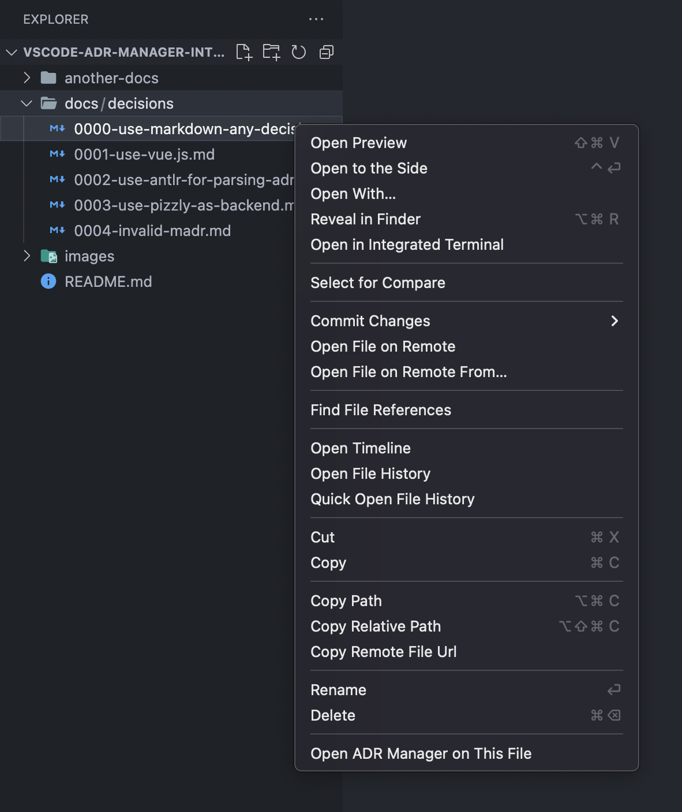

# Introduction to the VS Code Extension for the ADR Manager

This repository serves as a short introduction to the features of the Visual Studio Code (VS Code) extension for the ADR Manager. For more information, please go to the [VS Code Marketplace page of the extension](https://marketplace.visualstudio.com/items?itemName=StevenChen.vscode-adr-manager).


<hr>

## Prerequisites

* Install [VS Code](https://code.visualstudio.com)
* Install the [VS Code Extension for the ADR Manager](https://marketplace.visualstudio.com/items?itemName=StevenChen.vscode-adr-manager)
* Download this repository to your local computer
* Open the root folder of this repository in a VS Code instance. The folder `vscode-adr-manager-introduction` should be the only root folder in your current workspace.

Your VS Code workspace should look something like this: 



Feel free to open your own directory to experiment with the extension!

<hr>

## Features

### Commands

ADR Manager provides several commands that can be accessed via the Command Palette (`Ctrl+Shift+P` on Windows/Linux, `Cmd+Shift+P` on macOS). Commands provided by this extension will be prefixed by `ADR Manager:`.

ADR Manager currently provides the following commands:


#### Open ADR Manager



_Main webview of the ADR Manager._

When executing this command, the extension will open the main webview panel of the extension which lists every ADR in the ADR Directory it could find. From here, you may add and edit ADRs using the provided editor, or delete ADRs (i.e., move them to the trash can). If the user decides to edit an ADR, the extension will try to open another webview which shows the extension's ADR editor, prefilled with the data from that particular ADR.

The user can configure his preferred editor modes for adding and viewing ADRs based on the grade of detail in VS Code's settings.

```
Try to open the main webview and experiment with adding, editing and deleting ADRs.
See how these actions affect the file contents and the workspace!
```

<br/>

#### Add New ADR



_ADR editor provided by the ADR Manager._

When executing this command (or when clicking on the `Add ADR` button on the main webview), the extension will open a webview panel where the user can create a new ADR using the editor provided by the extension. The user may switch between editor modes to reveal or hide fields of the ADR based on the user's needs.

<br/>

#### Open ADR Manager on This File

When executing this command, the extension will try to open the ADR editor and fill it with information according to the content of the Markdown file that is currently in the active text editor of VS Code. If the Markdown file does not conform to MADR, the extension will show an error message.

This command works regardless of the location of the Markdown file, i.e., the Markdown file does not have to be located inside of the ADR Directory, although the extension will inform the user if that's the case (for consistency's sake).

**Note**: This command will only show in the command palette if the currently opened Markdown file loosely follows the naming conventions of MADR. See the extension's page on the Marketplace for the exact criteria.

```
Try opening a valid MADR in 'docs/decisions' in the VS Code text editor and executing this command.
Try the same with 'docs/decisions/0004-invalid-madr.md' and see what happens!
```

<br/>

#### Change ADR Directory

When executing this command, the extension will ask the user to type in a path to the new/preferred ADR Directory. This path must be a relative path relative to the root folder(s) of the workspace.

**Example**: If the root folder of the workspace is 'vscode-adr-manager-introduction' and I enter 'path/to/my/adr-directory', the resulting ADR Directory will be located at 'vscode-adr-manager-introduction/path/to/my/adr-directory/'.

The ADR Directory can also be changed in the [settings](#settings).

```
Try opening the main webview of the ADR Manager.
Then, change the ADR Directory from 'docs/decisions' to 'another-docs/decisions' and see what happens!
```

<br/>

#### Initialize ADR Directory

When executing this command, the extension will try to create the ADR Directory specified by the user. Additionally, the extension will fill the ADR Directory with some useful files to start using MADR.

If the ADR Directory already exists in the workspace, the extension will notify the user.

```
Try changing the ADR Directory to a new directory not present in this repository and executing this command.
Try executing the same command again immediately after and see what happens!
```

<hr>

### Menus

ADR Manager provides entries in the context menu of specific files and folders in the VS Code file explorer (i.e., when right-clicking on specific files or folders).


#### Open ADR Manager



_Context menu of the ADR Directory._

When opening the context menu for the ADR Directory or any folder along the way to the ADR Directory, there will be a new entry `Open ADR Manager` at the bottom of the context menu. Upon clicking that entry, the extension will execute the command [Open ADR Manager](#open-adr-manager), showing the main webview of the extension.

```
While the ADR Directory is set to 'docs/decisions', try to right-click on either 'docs' or 'decisions'
in the file explorer and look for the new entry.
```

<br/>

#### Open ADR Manager on This File



_Context menu of a MADR file._


When opening the context menu for a Markdown file that loosely follows the MADR naming conventions, there will be a new entry `Open ADR Manager on This File` at the bottom of the context menu. Upon clicking that entry, the extension will execute the command [Open ADR Manager on This File](#open-adr-manager-on-this-file) on the specified file.

```
Try to right-click any MADR in 'docs/decision' in the file explorer and look for the new entry.
Try to right-click this 'README.md' file and see what happens!
```

<hr>

### Linting

ADR Manager also provides some basic linting rules when editing a Markdown file that loosely follows the MADR naming conventions in the VS Code text editor. These linting rules may help the user to resolve issues with the extension not being able to parse an ADR in the ADR Directory.

```
The file 'docs/decisions/0004-invalid-madr.md' cannot be edited in the editor provided by the extension.
Try to open the file in the VS Code text editor and try to fix all errors.
Then try again to edit the file via the editor provided by the extension.
```

<hr>

### Snippets

ADR Manager provides two snippets that help the user to create MADRs via the VS Code text editor. These snippets insert MADR templates into Markdown files such that the user only has to fill out the fields of the MADR. The user can use the `Tab` key to jump to the next field until all fields have been filled out.

To insert a snippet, the user has to open a Markdown file and manually trigger IntelliSense (`Ctrl+Space`) and look for the keyword, or type in the keyword (or parts of it) to automatically trigger IntelliSense.

#### Basic MADR Template

This snippet inserts a MADR template at the cursor's current position that contains only the required fields of a MADR. The keyword for this snippet 'basic-madr'.

#### Professional MADR Template

This snippet inserts a MADR template at the cursor's position that contains all available fields of a MADR.
The keyword for this snippet is 'professional-madr'

```
Create a new Markdown file anywhere in the workspace.
Try to insert either of these snippets with IntelliSense. 
Try filling out the fields with 'tabbing' to the next field.
```